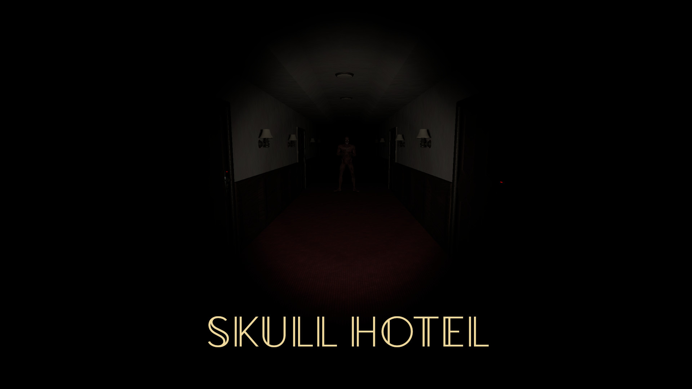
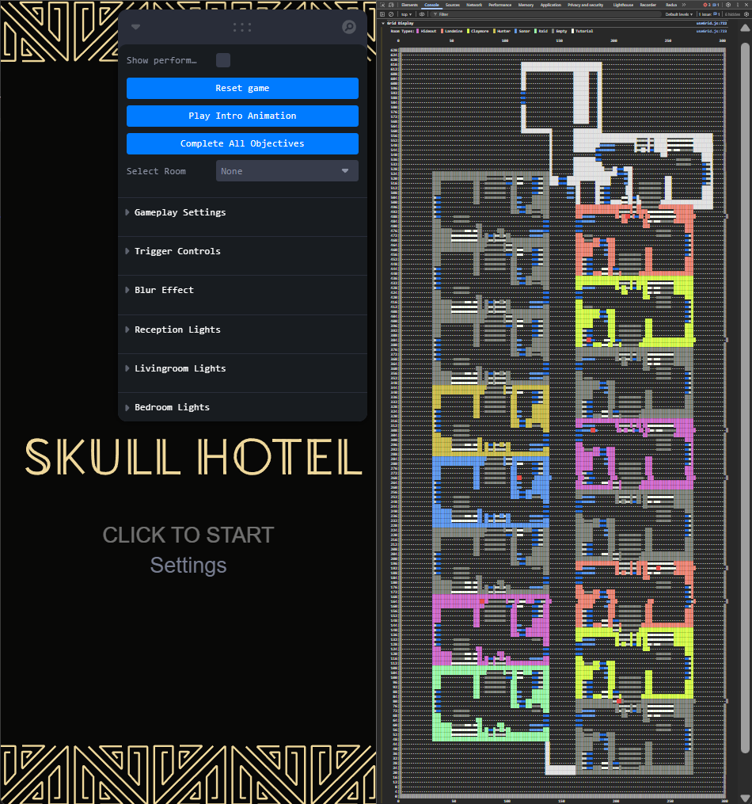

<div align="center" style="display: flex; justify-content: center; align-items: center; gap: 16px;">
  
</div>

In Skull Hotel, you play as a housekeeper tasked with cleaning 8 hotel rooms. Beware - deadly entities lurk in 50% of these rooms, waiting for your arrival. With 30 potential hiding spots randomly selected in each playthrough, your survival depends on vigilance: scrutinize every corner, listen carefully for unusual sounds, and remain alert at all times. The "guests" of Skull Hotel always leave subtle clues to their presence - spotting these hints is your only chance to survive.

## Installation

```bash
# Clone the repository
git clone https://github.com/JamesHall38/skullhotel.io.git
cd skullhotel

# Install dependencies
npm install

# Start the development server
npm run dev
```

## Debug Mode 🔍

Enable debug mode by appending `/#debug` to the game's URL to access the Leva configuration panel and view grid visualizations in the browser's developer console (you may need to zoom out with Ctrl+"-" to view the grid properly, as shown in the images below).

#### Map Visualization

The game features six distinct enemy types:

- 🟩 **Raid**: If you hear knocking or see a sign, you must hide and wait for the monster to leave.
- 🟨 **Claymore**: The monster is behind a door or curtain, and you must quickly close it before it attacks.
- 🟪 **Hideout**: It hides and surprises you while you're completing objectives.
- 🟥 **Landmine**: It hides and jumps at you if you move too close.
- 🟦 **Sonar**: Located in the bathroom - you must listen at the door and avoid opening it if you hear breathing.
- 🟧 **Hunter**: It emerges from a hiding spot and chases you - your only option is to run.

The console displays your current game seed with each enemy type represented by a unique color:

<div align="center">
  
</div>

## Resources 📚

- **Mixamo**: Character model and animations
- **BlenderKit**: 3D assets
- **AudioJungle**: Sound effects
- **AmbientCG**: Textures and materials


By Siddharth for you
